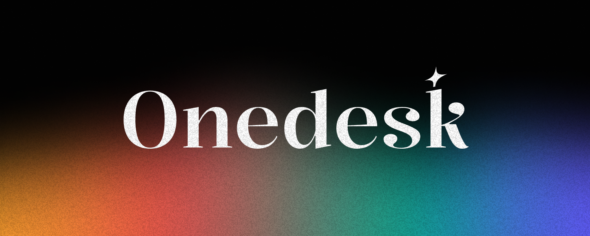

# OneDesk



## Description

**OneDesk** est une plateforme SaaS moderne qui combine les fonctionnalités d'un tableau blanc et d'une gestion de projet, inspirée de Notion. Ce projet est conçu pour être un outil simple, fluide et collaboratif, permettant aux utilisateurs de gérer leurs idées, projets, tâches et bien plus, le tout dans un environnement intégré et entièrement automatisé.

La plateforme offre une interface propre, épurée, et hautement personnalisable pour vous permettre de garder toutes vos informations organisées et accessibles, où que vous soyez.

## Fonctionnalités

- **Tableau blanc interactif** : Utilisez un tableau blanc pour organiser vos idées, projets et tâches en temps réel.
- **Gestion de projet** : Organisez des tâches, assignez des responsabilités, et suivez la progression de chaque projet.
- **Personnalisation** : Modifiez les couleurs, les styles et les widgets de votre espace pour qu'il réponde à vos besoins.
- **Collaboratif** : Partagez vos espaces de travail avec d'autres utilisateurs, collaborez en temps réel.
- **Automatisation** : Intégration avec plusieurs API pour automatiser des tâches et processus.

## Technologies

- **Frontend** : React.js, Next.js
- **Backend** : Node.js, Express
- **Base de données** : MongoDB
- **API utilisées** : API gratuites pour la gestion de projet (ex. Trello API)
- **Hébergement** : Heroku / Vercel

## Installation

1. Clonez ce repo :
   ```bash
   git clone https://github.com/ton-compte/onedesk.git
   ```

2. Accédez au dossier du projet :
   ```bash
   cd onedesk
   ```

3. Installez les dépendances :
   ```bash
   npm install
   ```

4. Démarrez le serveur en local :
   ```bash
   npm run dev
   ```

Le projet sera accessible à http://localhost:3000.

## Structure du projet

Voici une vue d'ensemble de la structure des dossiers du projet :

```
onedesk/
│
├── public/               # Fichiers statiques (images, icônes, etc.)
├── src/
│   ├── components/       # Composants React
│   ├── pages/            # Pages de l'application
│   ├── styles/           # Styles CSS/SCSS
│   ├── utils/            # Utilitaires et helpers
│   └── services/         # Logique de gestion API, base de données
│
├── package.json          # Dépendances et scripts
└── README.md             # Ce fichier
```

## Palette de couleurs

Pour une expérience utilisateur cohérente et agréable, nous avons choisi une palette de couleurs modernes et douces :

- **Rouge** : #E94B4B – Utilisé pour les erreurs ou alertes importantes.
- **Vert** : #00A68C – Pour les succès et validations.
- **Jaune/Orange** : #F9A825 – Pour les actions secondaires et les appels à l'action.
- **Violet** : #6A4CFF – Pour les éléments contrastants et interactifs.

## Contributions

Les contributions sont les bienvenues ! Pour contribuer au projet, veuillez suivre ces étapes :

1. Fork le projet.
2. Créez une branche pour votre fonctionnalité (`git checkout -b feature/nom-de-la-fonctionnalité`).
3. Faites vos modifications.
4. Committez vos changements (`git commit -m 'Ajout de fonctionnalité X'`).
5. Poussez votre branche (`git push origin feature/nom-de-la-fonctionnalité`).
6. Créez une pull request.

## Roadmap

- Initialisation du projet
- Ajout de fonctionnalités collaboratives (partage de tableaux)
- Intégration d'APIs externes pour automatisation
- Optimisation des performances
- Version stable pour production

## License

Ce projet est sous la licence MIT - voir le fichier LICENSE pour plus de détails.

---

OneDesk est conçu pour être un outil pratique, intuitif et puissant. Le but est de rendre la gestion de projet et l'organisation d'idées plus simples, efficaces, et agréables. Rejoignez-nous dans l'aventure et aidez-nous à faire de OneDesk un produit encore meilleur !